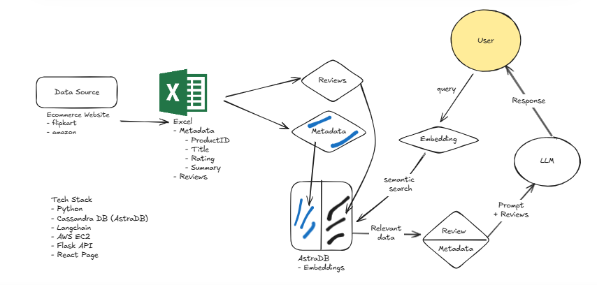

# Ecommerce ChatBot

## About The Project

This AI-powered chatbot enhances the shopping experience by offering personalized recommendations, and seamless customer support.

### Features

- AI-driven product recommendations
- Multi-platform integration (Web, WhatsApp, Telegram, etc.)
- Natural Language Understanding (NLU) with NLP models

## Screenshot



## Key Technologies

- **LangChain** – AI Framework
- **LangChain-AstraDB** – Vector storage
- **LangChain-Community** – LangChain tools
- **LangChain-Groq** – Fast inference
- **LangChain-HuggingFace** – Provides embeddings
- **Flask** – Deploys the chatbot as

## Table of Contents

- [Getting Started](#getting-started)
- [Contributing](#contributing)
- [License](#license)
- [Contact](#contact)
- [Acknowledgements](#acknowledgements)

### Getting Started

To get started with this project locally, you’ll need Python 3.10+ installed on your machine along with the necessary Python packages. You can either clone the repository and install dependencies manually or use Docker for an isolated environment.

## Installation Steps

1.  **Clone the repository**:

    - Open your terminal or command prompt.
    - Navigate to the directory where you want to install the project.
    - Run the following command to clone the GitHub repository:

    ```bash
    git clone https://github.com/shubhamprajapati7748/ecommerce-chatbot.git
    ```

2.  **Create a Virtual Environment (Optional)**:

    - It's recommended to use a virtual environment to manage dependencies. Run the following command:

    ```bash
    conda create -p <Environment_Name> python==<python version> -y
    ```

3.  **Activate the Virtual Environment (Optional)**:

    - Activate the virtual environment based on your operating system:

    ```bash
    conda activate <Environment_Name>/
    ```

4.  **Install Dependencies**:

    - Navigate to the project directory:

    ```bash
    cd [project_directory]
    ```

    - Run the following command to install project dependencies:

    ```bash
    pip install -r requirements.txt
    ```

5.  **Create `.env` file and add your API keys**:

    - Create a `.env` file in the root directory and add your Google Gemini API key for LLM interaction.

6.  **Run the Project**:

    - To start the application, run the following command:

    ```bash
    python app.py
    ```

7.  **Access the Project**:
    - Visit `http://127.0.0.1:5000` in your browser to use the app.

## Contributing

Contributions to the Google Gemini-Pro Chat Application are welcome! If you have suggestions, enhancements, or bug fixes, please follow the steps below:

1.  Fork the project.
2.  Create your feature branch (`git checkout -b feature/YourFeature`).
3.  Commit your changes (`git commit -m 'Add some feature'`).
4.  Push to the branch (`git push origin feature/YourFeature`).
5.  Open a pull request.

## License

Distributed under the MIT License. See `LICENSE.txt` for more information.

## Contact

- Shubham Prajapati - [shubhamprajapati7748@gmail.com](mailto:shubhamprajapati7748@gmail.com)

## Acknowledgements

- **Google Gemini** for providing LLM to process the user requests and generate the response in this project.
